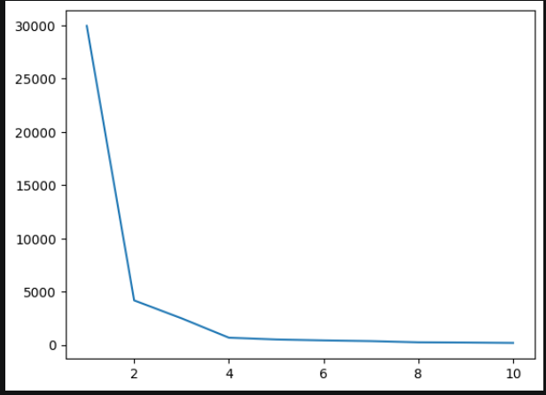
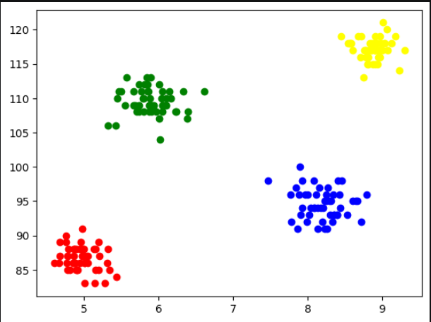

# K-Means Clustering Algorithm
## Intuition
- first, we assume n clusters (yes we need to "guess" the number of clusters from the start).
- we choose n points randomly as "centroids"
- then we mark nearest points to those centroids as that particular cluster
- now that we have obtained n clusters, we re-calculate centroids, and hence re-calculating the cluster points
- we repeat the above process till we reach the max iterations or there's no change in centroid.

## How to find the number of clusters?
we find the number of clusters using Elbow Curve.
it is a curve between WCSS (within clusters sum of squared distances, also called inertia) and number of clusters.




## Testing on a sample dataset
currently, this class contains one basic method -
```
kmc = KMeans(n_clusters=(default:2), max_iter=(default=:100))
y_pred = kmc.fit_predict(X)
```
the method ```fit_predict()``` returns a numpy array of clusters (assigned as 0,1,2..)

### Result 
